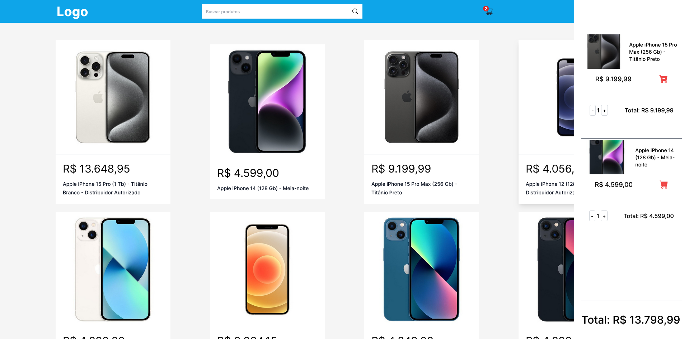

# Aplicação de e-comerce (baseado no Mercado livre)

Este é um projeto de um site de compras online. Ele me ajudou a aprimorar minhas habilidades de programação em React.js, Next.js, TypeScript e Tailwind por meio da prática constante.

### Screenshot Desktop

## Visão geral

### O Projeto

Os usuários devem ser capazes de:

-  Visualizar o layout ideal para o site, dependendo do tamanho da tela do seu dispositivo
-  Examinar a listagem dos produtos na tela (imagem, descrição e preço)
-  Utilizar a barra de pesquisa para encontrar o produto desejado
-  Adicionar o item desejado ao carrinho de compras
-  Visualizar a barra lateral do carrinho de compras listando os produtos adicionados
-  Remover um produto do carrinho
-  Visualizar o preço total da compra
-  Alterar a quantidade do produto

### Links

- Link direto: [link do projeto](https://carrinho-zustand.vercel.app/)

## Construído com

- [Next.js](https://nextjs.org/) - React framework
- [Tailwind css](https://tailwindcss.com/) - Para estilização
- Zustand - gerenciar estados
- Axios - Para consumir API
- Jest - Testes
- Responsividade
- Eslint - identação do código

## Autor

- Linkedin - [Vinicius Felipe](https://www.linkedin.com/in/vinicius-felipe-5148a81b5/)
